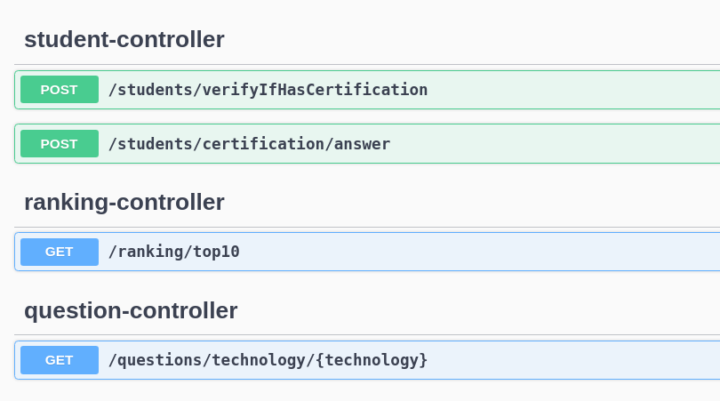

## Api de Certificação de Conhecimentos em Linguagens - Aplicação de Teste e Ranking

### Visão Geral
Esta aplicação é um sistema de certificação de conhecimentos em diferentes linguagens de programação. Permite que os usuários testem seus conhecimentos em uma linguagem específica através de um conjunto de perguntas e alternativas. Após completar o teste, os usuários recebem uma pontuação e são classificados em um ranking de acordo com suas pontuações.

### Funcionalidades
- **Teste de Conhecimentos**: Os usuários podem realizar testes de conhecimentos em diferentes linguagens de programação.
- **Ranking**: Os resultados dos testes são utilizados para classificar os usuários em um ranking global e por linguagem.
- **Registro de Usuários**: Novos usuários podem se registrar na aplicação para realizar os testes.
- **Autenticação**: A autenticação de usuários garante que apenas usuários registrados possam realizar testes e visualizar o ranking.

 ### endpoints
[cllique aqui para interagir com a api](http://localhost:8085/swagger-ui/index.html)
 

### Tecnologias Utilizadas

- **Java**: A aplicação é desenvolvida principalmente em Java, utilizando o framework Spring Boot para facilitar o desenvolvimento de aplicativos web.
- **Spring Data JPA**: Para interagir com o banco de dados.
- **docker-compose**: Para criar uma imagem do banco de dados postgree.
- **swagger**: para documentar a api.

### Configuração do Ambiente

1. **Java Development Kit (JDK)**: Certifique-se de ter o JDK instalado em sua máquina.
2. **Maven**: Utilizado para gerenciamento de dependências. Certifique-se de ter o Maven instalado.
3. **Banco de Dados**: A aplicação utiliza um banco de dados SQL. Você pode configurar as propriedades de conexão no arquivo `application.properties`. bem como utlizar uma imagem do banco de dados postgree no arquivo 'docker-compose' na raiz do projeto onde poderá cria-lo com o comando: 'docker-compose up -d'. apois isso rode o 'seed' presente no diretorio para inserir os dados mocados no banco de dados.

### Execução da Aplicação
1. Clone o repositório da aplicação para sua máquina local.
2. Importe o projeto em sua IDE.
3. Configure as propriedades do banco de dados conforme necessário.
4. Execute a aplicação a partir da classe principal (`Application.java`).
5. Acesse a aplicação em seu navegador utilizando o endereço local (`http://localhost:8085` por padrão).

### Contribuição
Contribuições são bem-vindas! Se você encontrar problemas ou tiver sugestões de melhorias, sinta-se à vontade para abrir uma issue ou enviar um pull request.

